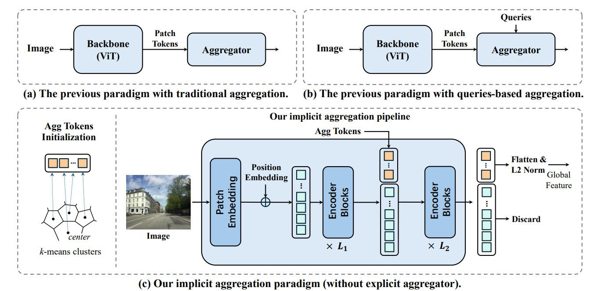

# ImAge

This is the official repository for the NeurIPS 2025 paper "[Towards Implicit Aggregation: Robust Image Representation for Place Recognition in the Transformer Era](https://openreview.net/pdf?id=uVYqwEgIpE)".

The code will be released before November 30th.

